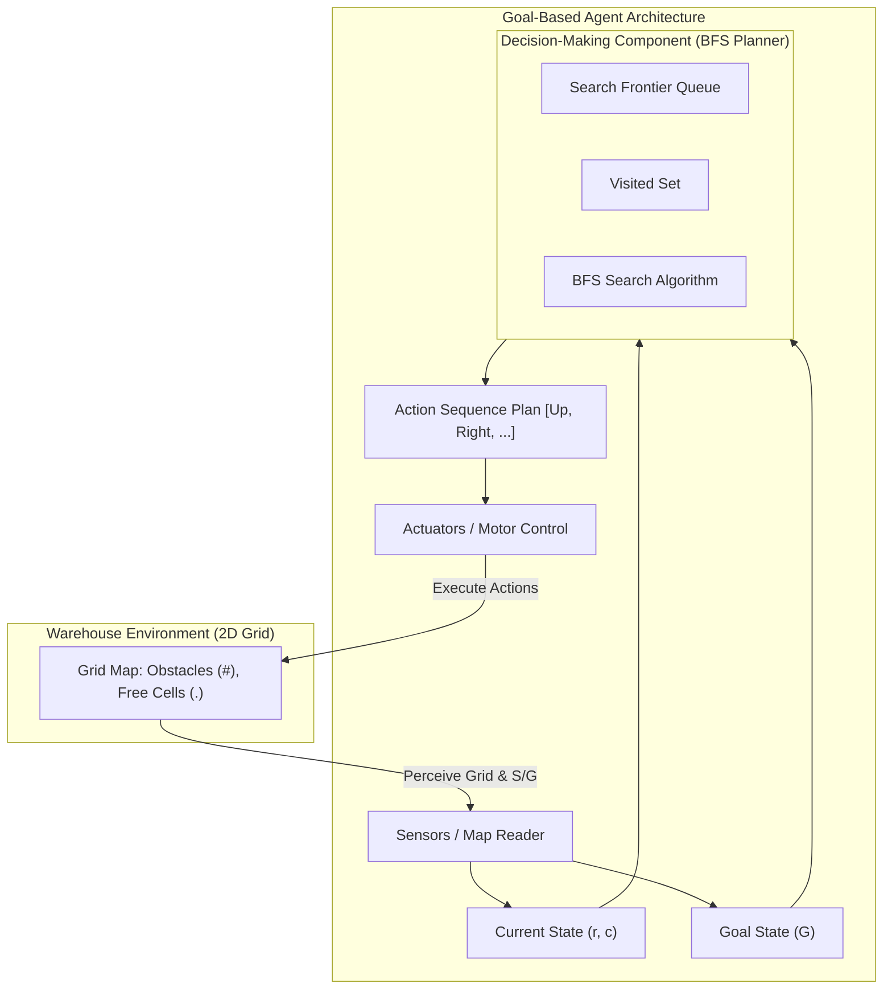

# Lab 1 Checkpoint: Constructing a Goal-Based Agent using an LLM

---

## Table of Contents

1. [Task 1: Understanding the Problem](#task-1-understanding-the-problem)
2. [Task 2: Agent Design Specification & Block Diagram](#task-2-agent-design-specification--block-diagram)
3. [Task 3: Prompt Engineering & Implementation](#task-3-prompt-engineering--implementation)
4. [Testing & Validation Log](#testing--validation-log)
5. [LLM Reflection & Critical Evaluation (LO5)](#llm-reflection--critical-evaluation-lo5)

---


## Task 1: Understanding the Problem


### 1. What is the environment?

- **Type**: 2D discrete, static, and fully observable grid map ($7 \times 21$).
- **Features**: Border walls and shelving unit obstacles (`#`), traversable open cells (`.`), start position `S` at $(1, 1)$, and goal position `G` at $(1, 19)$.


### 2. What is the goal of the agent?

- Determine and traverse a collision-free sequence of moves from `S` at $(1, 1)$ to `G` at $(1, 19)$ without stepping on obstacle cells (`#`).


### 3. What actions are available to the agent?

- Four orthogonal movement actions: `Up` ($row - 1$), `Down` ($row + 1$), `Left` ($col - 1$), `Right` ($col + 1$). Each step shifts position by 1 cell.


### 4. What information must the agent maintain in order to choose its next action?

- Map layout, current agent coordinate $(r, c)$, goal coordinate $(r_G, c_G)$, visited set (loop prevention), and parent pointers for path reconstruction.


### 5. Why is this an example of a goal-based agent rather than a simple reflex agent?

- A simple reflex agent acts only on immediate condition-action rules (e.g., "if wall, turn right") without representing distant target goals or state history, making it prone to dead-ends. A goal-based agent explicitly represents goal `G` and formulates a plan of action sequences to reach it.


### Think About It: Scaling to a Twice-As-Large Warehouse

- **Search Strategy**: Uninformed search like Breadth-First Search (BFS) remains complete and optimal for unweighted grids, but state exploration scales as $O(|V| + |E|)$.
- **Difficulties**: Memory overhead grows rapidly ($O(b^d)$) due to uniform wavefront expansion.
- **Improved Approach**: Use an informed heuristic search such as $A^*$ with Manhattan Distance ($h(n) = |r_n - r_G| + |c_n - c_G|$).

---


## Task 2: Agent Design Specification & Block Diagram


### Five Core Components:

1. **Environment**: 2D grid matrix with `#` (obstacles), `.` (free), `S`, and `G`.
2. **Current State**: Coordinate pair $(r, c)$. Initial state $S = (1, 1)$.
3. **Goal**: Target coordinate $G = (1, 19)$.
4. **Actions**: $A = \text{Up}, \text{Down}, \text{Left}, \text{Right}$. Precondition: target cell $\neq $.
5. **Decision-Making Component**: Offline path planner utilizing **Breadth-First Search (BFS)**.


### Architecture Block Diagram:




---


## Task 3: Prompt Engineering & Implementation


### Exact Prompts Used:


#### Prompt V1 (Suggested Lab Prompt - Verbatim):

```text
Write a well-documented Python program implementing a goal-based agent for the warehouse navigation problem shown above.
The program should
- represent the warehouse as a two-dimensional grid;
- determine a collision-free path from S to G;
- avoid all obstacles;
- print either the path found or a suitable message if no path exists;
- explain the search algorithm that has been chosen and why it is appropriate;
```


#### Prompt V2 (Refined Specification Prompt):

```text
Write a production-quality, modular Python 3 program (using standard libraries only, such as `collections.deque`) implementing a Goal-Based Agent for 2D grid warehouse navigation.

Input & Representation Requirements:
- Represent the warehouse map as a 2D grid.
- The map contains 'S' (Start), 'G' (Goal), '#' (Obstacles), and '.' (Free Space).
- Parse and validate S and G dynamically.

Algorithm & Architecture Requirements:
- Use Breadth-First Search (BFS) to guarantee the shortest collision-free path on an unweighted grid.
- Include a docstring explaining why BFS was chosen (completeness, optimality for uniform edge costs).

Output Requirements:
1. Print path length (total steps taken).
2. Print total number of states expanded during search.
3. Print directional sequence ("Up", "Down", "Left", "Right").
4. Print coordinate path list [(r1, c1), (r2, c2), ...].
5. Render ASCII map showing solution path overlaid with '*' characters.
6. Print clear message if no valid path exists.
```


### Generated Code Location:

The generated code is located at `[src/warehouse_agent.py](file:///Users/mittals/Desktop/AI%20Labs/lab1-goal-based-agent/src/warehouse_agent.py)`.

### Task 3 Required Questions & Answers:

1. **Did the LLM generate a working program on the first attempt?**
  `[TO FILL – Yes / No with brief explanation based on student's actual LLM session]`  
   *Sample Response*: Yes, syntactically valid code was generated on the first attempt, but Prompt V1 produced a basic output without state expansion metrics or map visualization, requiring Prompt V2 refinement.
2. **If not, how can you improve your prompt?**
  By adding precise engineering constraints (standard library limits, data structure requirements, return types, and exact reporting requirements).
3. **What search algorithm did the LLM choose?**
  Breadth-First Search (BFS) using a FIFO queue (`collections.deque`).
4. **Why do you think the LLM selected this algorithm?**
  Because the grid is unweighted, making BFS optimal for finding the shortest path while guaranteeing completeness.

---


## Testing & Validation Log


### Executed Test Cases (`src/test_agent.py`):


| Test Case ID | Scenario                              | Expected Result                          | Actual Result                                     | Status     |
| ------------ | ------------------------------------- | ---------------------------------------- | ------------------------------------------------- | ---------- |
| **TC-01**    | Default $7 \times 21$ Assignment Map  | Solution path found ($S \rightarrow G$). | Path length = 20 steps, 59 states expanded.       | **PASSED** |
| **TC-02**    | Trivial $3 \times 3$ Adjacent S-G Map | Path length = 1 step ("Right").          | Path = `[(1,1), (1,2)]`, direction = `Right`.     | **PASSED** |
| **TC-03**    | Unreachable Goal (surrounded by `#`)  | Path is `None`, clear output message.    | `None` returned gracefully.                       | **PASSED** |
| **TC-04**    | No Obstacle Traversal                 | 0 obstacle cells `#` in path.            | 0 obstacle cells in path.                         | **PASSED** |
| **TC-05**    | Valid Single Steps                    | Manhattan distance == 1 for all steps.   | Single orthogonal step verified for all 20 steps. | **PASSED** |


### Execution Commands:

```bash
python3 src/warehouse_agent.py
python3 src/test_agent.py
python3 src/run_all.py
```

Real output log captured in `[src/output.txt](file:///Users/mittals/Desktop/AI%20Labs/lab1-goal-based-agent/src/output.txt)`.

---


## LLM Reflection & Critical Evaluation (LO5)


### Division of Work:


| Component                                                    | Author                        | Verification Method                               |
| ------------------------------------------------------------ | ----------------------------- | ------------------------------------------------- |
| Problem Formulation & Task 1 Answers                         | Student with LLM assistance   | Aligned with Russell & Norvig definitions.        |
| Agent Architecture Design & Mermaid Diagram                  | Student structured, LLM drawn | Verified goal-based feedback loops.               |
| Prompts V1 & V2                                              | Student                       | Evaluated output quality under constraints.       |
| Source Code (`src/warehouse_agent.py`)                       | LLM-generated                 | Line-by-line review, annotated with LLM comments. |
| Test Suite (`src/test_agent.py`) & Runner (`src/run_all.py`) | LLM-generated                 | Verified 5/5 unit test suite execution.           |


### Critical Analysis of LLM-Assisted Engineering (Learning Objective 5):

- **Strengths**: High speed for generating boilerplate code, standard library usage compliance, rapid iterative refinement.
- **Limitations**: Vague prompts produce minimal non-robust implementations; risk of unneeded 3rd-party dependencies unless strictly prohibited; potential for subtle off-by-one errors requiring manual code audit.
- **Conclusion**: LLMs accelerate development significantly when coupled with precise prompts, but human engineering oversight and automated unit tests remain indispensable.

---


## Evidence 

- **Source Code**: `[src/warehouse_agent.py](file:///Users/mittals/Desktop/AI%20Labs/lab1-goal-based-agent/src/warehouse_agent.py)`
- **Test Suite**: `[src/test_agent.py](file:///Users/mittals/Desktop/AI%20Labs/lab1-goal-based-agent/src/test_agent.py)`
- **Output Log**: `[src/output.txt](file:///Users/mittals/Desktop/AI%20Labs/lab1-goal-based-agent/src/output.txt)`

