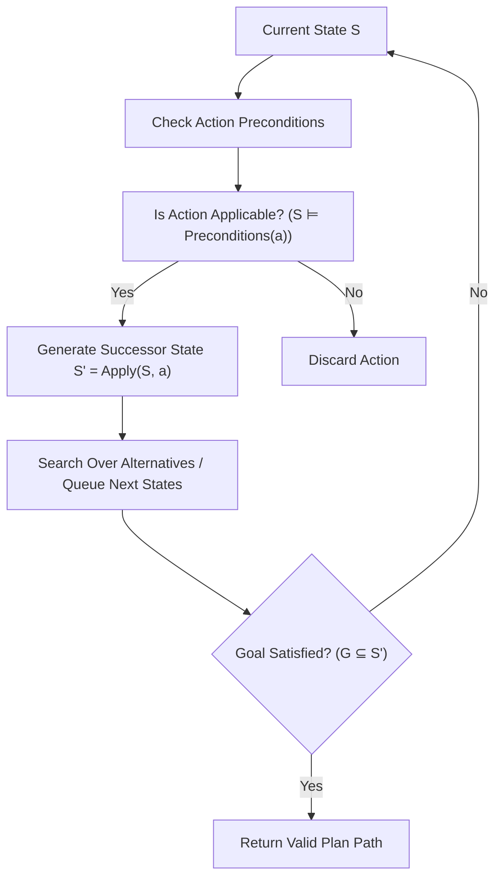

# Checkpoint Task 4: Logic and Search

**Student Name:** AI Undergraduate Student  
**Lab Assignment:** Laboratory – Logical Reasoning for Planning  

---

## 1. Completed Planning Flow Diagram

### Filled-in Question Step:
> **Question:** What is the missing step `?` in the flow description?  
> **Answer:** **"Is the action applicable ($S \models \text{Preconditions}(a)$)?"**  
> If True, the system proceeds to compute the successor state $S' = \text{Apply}(S, a)$; if False, the branch is pruned immediately.

---

## 2. Explanation of How Logic and Search Work Together

> **Core Insight:** *"Logic determines what is possible; search determines what to try."*

### 1. The Role of Logical Reasoning (Local Validity)
The logical reasoning component operates at the **single-step state transition level**. It uses propositional inference to answer two fundamental questions:
1. **Applicability:** Is action $a$ executable in state $S$? ($S \models \text{Preconditions}(a)$)
2. **State Update:** What changes occur in the world when $a$ is executed? ($S' = (S \setminus \text{neg\_eff}) \cup \text{pos\_eff}$)

Without logic, the agent would have no formal mechanism to know which transitions are physically valid, leading to illegal moves (such as picking up a package from a location where neither robot nor package exists).

### 2. The Role of Search (Global Exploration)
The search component operates at the **multi-step sequence level**. It manages the systematic exploration of the state-space tree created by applying applicable actions:
1. **Branching & Alternatives:** Search keeps track of unvisited states and alternative action paths using queue structures (`collections.deque`).
2. **Goal Guidance:** Search continually checks whether any explored state satisfies the goal condition ($G \subseteq S$).

Without search, logical reasoning could tell you if individual moves are legal, but could not determine which sequence of moves will actually reach the goal destination efficiently.

---

## 3. Synthesis: Logic + Search = Planning

Classical planning is precisely the integration of these two paradigms:
- **Logic** acts as the **pruning filter** that eliminates illegal actions and computes precise deterministic state transitions.
- **Search** acts as the **navigator** that systematically explores valid state transitions to find a path from $I$ to $G$.

---

## 4. Evidence Trace

In `src/planner.py`:
- **Logical Component:** `action.applicable(current_state)` & `action.apply(current_state)`
- **Search Component:** `while queue:` loop managing FIFO expansion and `visited` set tracking.
