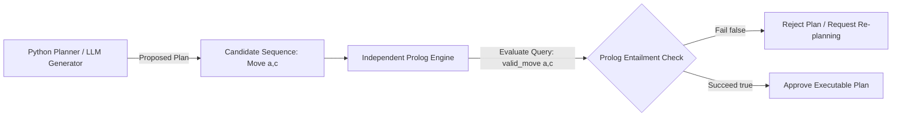

# Checkpoint Task 7: Using Prolog to Check a Proposed Plan

**Student Name:** AI Undergraduate Student  
**Lab Assignment:** Laboratory – Logical Reasoning for Planning  

---

## 1. Prolog Program & Valid Move Queries

The Prolog verifier rule in [planner.pl](file:///Users/mittals/Desktop/AI%20Labs/lab3-logical-planning/prolog/planner.pl) is defined as:

```prolog
valid_move(X, Y) :-
    connected(X, Y).
```

### Proposed Plan Step Queries & Execution Results

Suppose the Python planner proposes the two-step movement sequence: `Move(a, b)` followed by `Move(b, c)`.

| Prolog Query | Expected Result | Actual Result | Verification Meaning |
| :--- | :--- | :--- | :--- |
| `?- valid_move(a, b).` | `true.` | `true.` | Direct topological connection $A \rightarrow B$ exists. Step 1 is valid. |
| `?- valid_move(b, c).` | `true.` | `true.` | Direct topological connection $B \rightarrow C$ exists. Step 2 is valid. |
| `?- valid_move(a, c).` | `false.` | `false.` | Direct connection $A \rightarrow C$ does NOT exist. |

---

## 2. Challenge Scenario: Detecting an Invalid Proposed Action

> **Challenge Task:** Suppose the Python planner proposes a direct jump: `Move(a, c)`. Use Prolog to check if this action is valid.

### Query & Output:
```prolog
?- valid_move(a, c).
false.
```

### **Analysis:**
The query `valid_move(a, c)` fails and returns `false.`. 
Because there is no direct link between $A$ and $C$ in the warehouse knowledge base (`connected(a, c)` is absent), Prolog formally rejects the proposed move.

This demonstrates that Prolog can catch illegal actions proposed by an external agent (such as an LLM or bugged Python generator) that attempt to teleport across non-adjacent map locations.

---

## 3. Think About It: The Generate-Verify Architecture

> **Architecture:** **Generate $\rightarrow$ Independent Verification**



### Reflection:
This workflow illustrates a fundamental pattern in trustworthy AI design:
1. **The Generator (Python / LLM):** Uses search algorithms or generative models to rapidly propose candidate solutions.
2. **The Verifier (Prolog Engine):** Evaluates candidate steps against formal domain rules using sound logical inference.

By decoupling generation from verification, we ensure that even if the generator makes an error or hallucination, the independent logical verifier guarantees that no invalid or dangerous action is ever executed in the physical environment.
